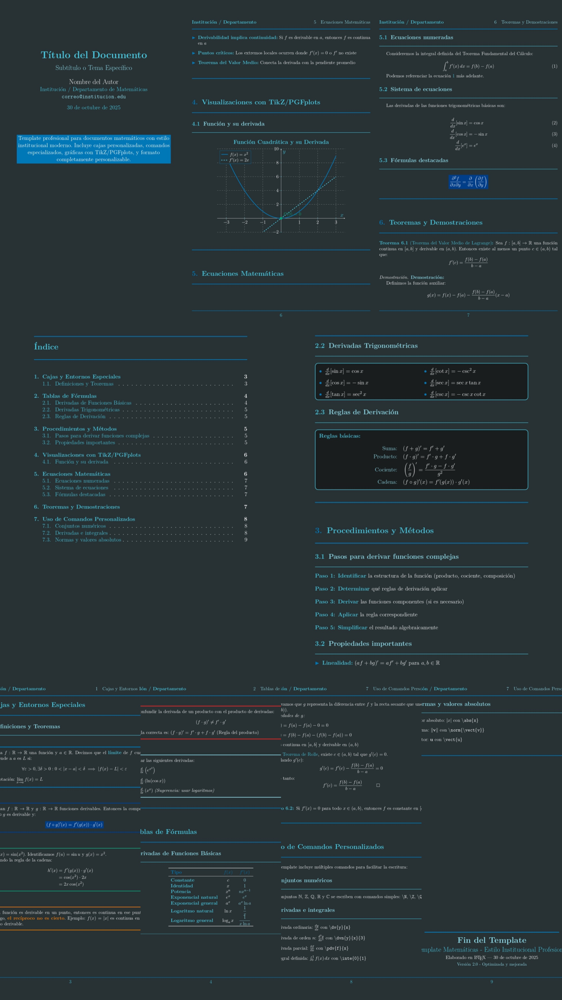

# Template LaTeX para Documentos Institucionales

[](https://www.latex-project.org/)
[](https://opensource.org/licenses/MIT)
[](https://github.com/tu-usuario/tu-repo/graphs/commit-activity)

> Template LaTeX para Documentos Institucionales
Template con estilo moderno para escribir documentos matemáticos en LaTeX. Incluye cajas personalizadas, comandos útiles y soporte para gráficas.

# Vista previa


# Requisitos

Tener LaTeX instalado (MiKTeX, TeX Live o MacTeX)

Editor recomendado: VSCode, TeXstudio o Overleaf

# Uso
Abre el archivo template.tex

Edita el título, autor e institución

Usa las cajas y comandos incluidos para estructurar tu contenido

# Compilación

VSCode: guardar o Ctrl+Alt+B

TeXworks: botón de compilar

Terminal: pdflatex template.tex (dos veces)

# Personalización
Puedes cambiar los colores en las primeras líneas del archivo. Hay paletas sugeridas incluidas.
# Paletas alternativas sugeridas:


**Paleta Azul:**
```latex
\definecolor{primary}{HTML}{0077b6}
\definecolor{secondary}{HTML}{023e8a}
\definecolor{accent}{HTML}{48cae4}
\definecolor{highlight}{HTML}{90e0ef}
\definecolor{success}{HTML}{06a77d}
\definecolor{warning}{HTML}{f77f00}
\definecolor{danger}{HTML}{d62828}
\definecolor{dark}{HTML}{293133}
\definecolor{light}{HTML}{f8f9fa}
\definecolor{background}{HTML}{1a1d1e}
```

**Paleta Verde:**
```latex
\definecolor{primary}{HTML}{00AF54}
\definecolor{secondary}{HTML}{00AF54}
\definecolor{accent}{HTML}{DEE0D8}
\definecolor{highlight}{HTML}{EEF4D4}
\definecolor{success}{HTML}{06a77d}
\definecolor{warning}{HTML}{f77f00}
\definecolor{danger}{HTML}{d62828}
\definecolor{dark}{HTML}{293133}
\definecolor{light}{HTML}{f8f9fa}
\definecolor{background}{HTML}{293133}
\definecolor{info}{HTML}{48cae4}
```

# Archivos
```bash
latex-math-template/
├── template.tex
├── README.md
├── preview.png
└── examples/
```
**: Octubre 2025
